# Complete Trading System Architecture Diagram

## Overview
This diagram represents the complete architecture of the crypto trading system, showing all components, data flows, and integrations with detailed focus on Risk, Order, Position/PnL, and User management integration with the Orchestrator.

## Mermaid Diagram

```mermaid
graph TB
    %% User Interface Layer
    subgraph "Frontend Layer"
        FE[React Frontend<br/>Port 5173]
        FE --> |HTTP/WebSocket| API
    end

    %% Main Application Entry
    subgraph "Application Core"
        APP[app.py<br/>FastAPI Application<br/>Port 8000]
        QTS[QuantumTradingSystem<br/>Main Trading System]
        LIFESPAN[Lifespan Manager<br/>System Initialization]
        
        APP --> QTS
        APP --> LIFESPAN
    end

    %% API Layer
    subgraph "API Layer (/api)"
        API[API Router]
        AUTH[auth.py<br/>Authentication]
        MARKET[market.py<br/>Market Data]
        DASHBOARD[dashboard_api.py<br/>Dashboard APIs]
        AUTONOMOUS[autonomous_trading.py<br/>Trading Control]
        HEALTH[system_health.py<br/>Health Monitoring]
        ORDERS[order_management.py<br/>Order APIs]
        POSITIONS[position_management.py<br/>Position APIs]
        TRADES[trade_management.py<br/>Trade APIs]
        USERS[user_management.py<br/>User APIs]
        CRYPTO_DATA[crypto_market_data.py<br/>Real Crypto Data]
        WEBSOCKET[websocket.py<br/>Real-time Updates]
        
        API --> AUTH
        API --> MARKET
        API --> DASHBOARD
        API --> AUTONOMOUS
        API --> HEALTH
        API --> ORDERS
        API --> POSITIONS
        API --> TRADES
        API --> USERS
        API --> CRYPTO_DATA
        API --> WEBSOCKET
    end

    %% Core Trading Orchestrator with detailed components
    subgraph "Trading Orchestrator Hub"
        ORCHESTRATOR[TradingOrchestrator<br/>Main System Controller]
        
        subgraph "Risk Management Layer"
            RISK_MGR[RiskManager<br/>Basic Risk Validation]
            ENHANCED_RISK[EnhancedCryptoRiskManager<br/>Advanced Risk + Black Swan]
            RISK_CHECKS[Pre-Trade Risk Checks<br/>Position Size • Daily Loss • Correlation]
            RISK_MONITOR[Real-time Risk Monitoring<br/>Portfolio Risk • VaR • Emergency Stop]
            
            RISK_MGR --> RISK_CHECKS
            ENHANCED_RISK --> RISK_MONITOR
            RISK_CHECKS --> RISK_MONITOR
        end
        
        subgraph "Order Management Layer"
            ORDER_MGR[OrderManager<br/>Order Processing Hub]
            QUANTUM_EXEC[QuantumExecutionEngine<br/>Advanced Order Execution]
            ORDER_QUEUE[Order Queue<br/>Priority Scoring • Strategy Selection]
            EXEC_STRATEGIES[Execution Strategies<br/>Quantum • TWAP • Iceberg • Zero-Slippage]
            
            ORDER_MGR --> QUANTUM_EXEC
            QUANTUM_EXEC --> ORDER_QUEUE
            ORDER_QUEUE --> EXEC_STRATEGIES
        end
        
        subgraph "Position & PnL Layer"
            POS_TRACKER[ProductionPositionTracker<br/>Real-time Position Monitoring]
            PNL_CALC[PnL Calculator<br/>Realized • Unrealized • Performance]
            PERFORMANCE[PerformanceAnalyzer<br/>Metrics • Win Rate • Drawdown]
            POS_EVENTS[Position Events<br/>Updates • Closures • Stop-Loss]
            
            POS_TRACKER --> PNL_CALC
            PNL_CALC --> PERFORMANCE
            POS_TRACKER --> POS_EVENTS
        end
        
        subgraph "User Management Layer"
            USER_MGR[UserManager<br/>Authentication • Registration]
            USER_TRACKER[UserTracker<br/>Sessions • Activity Logging]
            API_KEY_MGR[API Key Manager<br/>Multi-Broker • Secure Storage]
            SESSION_MGR[Session Manager<br/>JWT • Redis Sessions]
            
            USER_MGR --> SESSION_MGR
            USER_TRACKER --> SESSION_MGR
            USER_MGR --> API_KEY_MGR
        end
        
        subgraph "Trade Allocation Layer"
            TRADE_ALLOC[EnhancedCryptoTradeAllocator<br/>Intelligent Position Sizing]
            ALLOC_CALC[Allocation Calculator<br/>Risk-Adjusted • Performance-Based]
            PORTFOLIO_OPT[Portfolio Optimizer<br/>Volatility • Correlation • ML]
            
            TRADE_ALLOC --> ALLOC_CALC
            ALLOC_CALC --> PORTFOLIO_OPT
        end
        
        %% Orchestrator connections to layers
        ORCHESTRATOR --> RISK_MGR
        ORCHESTRATOR --> ENHANCED_RISK
        ORCHESTRATOR --> ORDER_MGR
        ORCHESTRATOR --> POS_TRACKER
        ORCHESTRATOR --> USER_MGR
        ORCHESTRATOR --> TRADE_ALLOC
    end

    %% Enhanced Strategy Orchestrator
    subgraph "Strategy Orchestrator"
        STRAT_ORCH[EnhancedCryptoStrategyOrchestrator<br/>Strategy Coordinator]
        EVENT_BUS[EventBus<br/>Inter-component Communication]
        SIGNAL_FUSION[Signal Fusion Engine<br/>Confluence • Quality Scoring]
        
        STRAT_ORCH --> EVENT_BUS
        STRAT_ORCH --> SIGNAL_FUSION
    end

    %% Trading Strategies
    subgraph "Trading Strategies"
        MOMENTUM[CryptoMomentumSurfer<br/>Momentum Strategy]
        VOLATILITY[CryptoVolatilityExplosion<br/>Volatility Strategy]
        NEWS[CryptoNewsImpactScalper<br/>News-based Strategy]
        VOLUME[CryptoVolumeProfileScalper<br/>Volume Strategy]
        CONFLUENCE[CryptoConfluenceAmplifier<br/>Signal Confluence]
        REGIME[CryptoRegimeAdaptiveController<br/>Market Regime Adaptation]
        
        STRAT_ORCH --> MOMENTUM
        STRAT_ORCH --> VOLATILITY
        STRAT_ORCH --> NEWS
        STRAT_ORCH --> VOLUME
        STRAT_ORCH --> CONFLUENCE
        STRAT_ORCH --> REGIME
    end

    %% Edge Intelligence Components
    subgraph "Edge AI Intelligence"
        AI_PRED[QuantumAIPredictor<br/>4-Model AI Ensemble]
        ONCHAIN[OnChainIntelligence<br/>Smart Money Tracking]
        SOCIAL[QuantumSocialAnalyzer<br/>Social Sentiment]
        RISK_PRED[QuantumRiskPredictor<br/>Risk Prediction]
        ARB_ENGINE[CrossChainArbitrageEngine<br/>Cross-exchange Arbitrage]
        
        subgraph "AI Models"
            TRANSFORMER[Transformer Model<br/>Sequence Prediction]
            CNN[CNN Model<br/>Pattern Recognition]
            LSTM[LSTM Model<br/>Volatility Prediction]
            RL_AGENT[RL Agent<br/>Reinforcement Learning]
            
            AI_PRED --> TRANSFORMER
            AI_PRED --> CNN
            AI_PRED --> LSTM
            AI_PRED --> RL_AGENT
        end
    end

    %% Data Models and Storage
    subgraph "Data Layer"
        DB[(PostgreSQL Database<br/>Trading Data)]
        REDIS[(Redis Cache<br/>Real-time Data)]
        
        subgraph "Database Models"
            USER_MODEL[User Model<br/>Authentication & Settings]
            POSITION_MODEL[Position Model<br/>Trading Positions]
            TRADE_MODEL[Trade Model<br/>Trade History]
            ORDER_MODEL[Order Model<br/>Order Management]
            MARKET_MODEL[CryptoMarketData<br/>Price & Volume Data]
            RISK_MODEL[RiskMetric<br/>Risk Analytics]
        end
        
        DB --> USER_MODEL
        DB --> POSITION_MODEL
        DB --> TRADE_MODEL
        DB --> ORDER_MODEL
        DB --> MARKET_MODEL
        DB --> RISK_MODEL
    end

    %% External Integrations
    subgraph "External Data Sources"
        BINANCE[Binance API<br/>Real Crypto Data]
        TWITTER[Twitter API<br/>Social Sentiment]
        REDDIT[Reddit API<br/>Social Data]
        ETH_NODE[Ethereum Node<br/>On-chain Data]
        BSC_NODE[BSC Node<br/>DeFi Data]
        NEWS_API[News APIs<br/>Market News]
    end

    %% Configuration and Security
    subgraph "Configuration & Security"
        CONFIG[Config Management<br/>YAML Configuration]
        AUTH_MGR[SecureAuthManager<br/>JWT Authentication]
        ENCRYPT[EncryptionManager<br/>Data Security]
        COMPLIANCE[ComplianceManager<br/>Trading Compliance]
    end

    %% Monitoring and Analytics
    subgraph "Monitoring & Analytics"
        PROMETHEUS[Prometheus Metrics<br/>System Monitoring]
        HEALTH_CHECK[HealthChecker<br/>System Health]
        PERF_ANALYZER[PerformanceAnalyzer<br/>Trading Analytics]
        NOTIFICATION[NotificationManager<br/>Alerts & Updates]
        WEBSOCKET_MGR[WebSocketManager<br/>Real-time Updates]
    end

    %% Critical Data Flow - Trading Execution Pipeline
    STRAT_ORCH --> |Signals| SIGNAL_FUSION
    SIGNAL_FUSION --> |Validated Signals| RISK_CHECKS
    RISK_CHECKS --> |Risk Approved| ALLOC_CALC
    ALLOC_CALC --> |Position Size| ORDER_QUEUE
    ORDER_QUEUE --> |Prioritized Orders| EXEC_STRATEGIES
    EXEC_STRATEGIES --> |Executed Trades| POS_TRACKER
    POS_TRACKER --> |Position Updates| PNL_CALC
    PNL_CALC --> |Performance Data| PERFORMANCE

    %% Risk Integration Flow
    RISK_MONITOR --> |Risk Alert| ORCHESTRATOR
    ENHANCED_RISK --> |Emergency Stop| ORDER_MGR
    POS_EVENTS --> |Stop Loss Trigger| RISK_MONITOR

    %% User Integration Flow
    AUTH --> |Authentication| USER_MGR
    SESSION_MGR --> |User Sessions| USER_TRACKER
    API_KEY_MGR --> |Broker Keys| CRYPTO_DATA
    USER_TRACKER --> |Activity Log| PERFORMANCE

    %% Real-time Data Flow
    ORCHESTRATOR --> EVENT_BUS
    EVENT_BUS --> |Events| WEBSOCKET_MGR
    WEBSOCKET_MGR --> |Live Updates| WEBSOCKET
    POS_EVENTS --> |Position Events| EVENT_BUS
    RISK_MONITOR --> |Risk Events| EVENT_BUS

    %% Strategy to Edge AI Flow
    STRAT_ORCH --> AI_PRED
    STRAT_ORCH --> ONCHAIN
    STRAT_ORCH --> SOCIAL
    STRAT_ORCH --> RISK_PRED
    STRAT_ORCH --> ARB_ENGINE

    %% Core to Data Layer
    ORDER_MGR --> ORDER_MODEL
    POS_TRACKER --> POSITION_MODEL
    TRADE_ALLOC --> TRADE_MODEL
    USER_MGR --> USER_MODEL
    RISK_MGR --> RISK_MODEL
    PNL_CALC --> DB
    PERFORMANCE --> DB

    %% Cache Layer
    QUANTUM_EXEC --> REDIS
    POS_TRACKER --> REDIS
    SESSION_MGR --> REDIS
    RISK_MONITOR --> REDIS
    PERF_ANALYZER --> REDIS

    %% External Data Connections
    CRYPTO_DATA --> BINANCE
    SOCIAL --> TWITTER
    SOCIAL --> REDDIT
    ONCHAIN --> ETH_NODE
    ONCHAIN --> BSC_NODE
    NEWS --> NEWS_API

    %% Security & Config
    AUTH --> AUTH_MGR
    AUTH_MGR --> ENCRYPT
    ORCHESTRATOR --> CONFIG
    ORDER_MGR --> COMPLIANCE
    USER_MGR --> ENCRYPT

    %% Monitoring
    APP --> PROMETHEUS
    ORCHESTRATOR --> HEALTH_CHECK
    PERF_ANALYZER --> PROMETHEUS
    ORCHESTRATOR --> NOTIFICATION

    %% API to Core Connections
    AUTONOMOUS --> ORCHESTRATOR
    ORDERS --> ORDER_MGR
    POSITIONS --> POS_TRACKER
    TRADES --> TRADE_ALLOC
    USERS --> USER_MGR
    DASHBOARD --> PERFORMANCE

    %% Frontend to API
    FE --> API

    %% Styling
    classDef orchestrator fill:#ffeb3b,stroke:#f57f17,stroke-width:3px
    classDef riskComponent fill:#f44336,stroke:#c62828,stroke-width:2px
    classDef orderComponent fill:#2196f3,stroke:#1565c0,stroke-width:2px
    classDef positionComponent fill:#4caf50,stroke:#2e7d32,stroke-width:2px
    classDef userComponent fill:#9c27b0,stroke:#6a1b9a,stroke-width:2px
    classDef strategy fill:#f3e5f5,stroke:#4a148c,stroke-width:2px
    classDef aiComponent fill:#e8f5e8,stroke:#1b5e20,stroke-width:2px
    classDef dataComponent fill:#fff3e0,stroke:#e65100,stroke-width:2px
    classDef apiComponent fill:#fce4ec,stroke:#880e4f,stroke-width:2px
    classDef external fill:#f1f8e9,stroke:#33691e,stroke-width:2px

    class ORCHESTRATOR orchestrator
    class RISK_MGR,ENHANCED_RISK,RISK_CHECKS,RISK_MONITOR riskComponent
    class ORDER_MGR,QUANTUM_EXEC,ORDER_QUEUE,EXEC_STRATEGIES orderComponent
    class POS_TRACKER,PNL_CALC,PERFORMANCE,POS_EVENTS positionComponent
    class USER_MGR,USER_TRACKER,API_KEY_MGR,SESSION_MGR userComponent
    class MOMENTUM,VOLATILITY,NEWS,VOLUME,CONFLUENCE,REGIME strategy
    class AI_PRED,ONCHAIN,SOCIAL,RISK_PRED,ARB_ENGINE,TRANSFORMER,CNN,LSTM,RL_AGENT aiComponent
    class DB,REDIS,USER_MODEL,POSITION_MODEL,TRADE_MODEL,ORDER_MODEL,MARKET_MODEL,RISK_MODEL dataComponent
    class API,AUTH,MARKET,DASHBOARD,AUTONOMOUS,HEALTH,ORDERS,POSITIONS,TRADES,USERS,CRYPTO_DATA,WEBSOCKET apiComponent
    class BINANCE,TWITTER,REDDIT,ETH_NODE,BSC_NODE,NEWS_API external
```



## Enhanced Architecture Details

### **🎯 Trading Orchestrator Hub - Core Integration**

The **TradingOrchestrator** serves as the central nervous system that coordinates all critical trading functions:

#### **1. Risk Management Integration**
- **Basic Risk Manager**: Position size, daily loss, stop-loss validation
- **Enhanced Crypto Risk Manager**: Advanced correlation analysis, black swan detection
- **Real-time Risk Monitoring**: Continuous portfolio risk assessment with emergency controls
- **Risk-First Flow**: Every trade passes through multi-layer risk validation

#### **2. Order Management Integration**
- **OrderManager**: Central order processing hub
- **QuantumExecutionEngine**: Advanced execution with multiple strategies
- **Order Queue**: Priority-based order processing with intelligent routing
- **Execution Strategies**: Quantum optimal, TWAP, Iceberg, Zero-slippage algorithms

#### **3. Position & PnL Integration**
- **ProductionPositionTracker**: Real-time position monitoring with Redis persistence
- **PnL Calculator**: Live calculation of realized/unrealized PnL
- **PerformanceAnalyzer**: Advanced metrics including Sharpe ratio, max drawdown
- **Position Events**: Automated stop-loss triggers and position updates

#### **4. User Management Integration**
- **UserManager**: Authentication, registration, and API key management
- **UserTracker**: Session management and activity logging
- **SessionManager**: JWT-based authentication with Redis sessions
- **Multi-Broker Support**: Secure API key storage for multiple exchanges

### **🔄 Critical Trading Flow**

```
1. Signal Generation (Strategies) 
   ↓
2. Signal Fusion & Quality Scoring
   ↓ 
3. Multi-Layer Risk Validation (Basic + Enhanced)
   ↓
4. Intelligent Position Sizing (ML-based allocation)
   ↓
5. Priority-Based Order Queue
   ↓
6. Quantum Execution Strategies
   ↓
7. Real-time Position Updates
   ↓
8. Live PnL Calculation & Performance Tracking
   ↓
9. WebSocket Broadcasting to Frontend
```

### **⚡ Real-Time Integration**

- **EventBus**: Central event system for component communication
- **WebSocketManager**: Real-time updates to frontend dashboard
- **Redis Integration**: High-speed caching for positions, sessions, market data
- **Live Risk Monitoring**: Continuous portfolio risk assessment
- **Automated Controls**: Emergency stops, stop-loss triggers, risk alerts

### **🛡️ Enhanced Risk Features**

- **Pre-Trade Validation**: Position size, correlation, daily loss checks
- **Black Swan Detection**: Advanced volatility and correlation break monitoring
- **Emergency Controls**: Automatic trading suspension during extreme market events
- **Portfolio Risk**: Real-time VaR calculation and concentration monitoring
- **Multi-Timeframe Analysis**: Risk assessment across different time horizons

### **📊 Advanced Analytics Integration**

- **Real-time Performance**: Live PnL, win rate, profit factor calculation
- **User Analytics**: Individual performance tracking and optimization
- **Strategy Performance**: ML-based strategy weight optimization
- **Risk Analytics**: Comprehensive risk metrics and reporting
- **Compliance Monitoring**: Automated regulatory compliance checks

This integrated architecture ensures that Risk, Order, Position/PnL, and User management work seamlessly together through the central TradingOrchestrator, providing institutional-grade trading capabilities with real-time monitoring and advanced analytics. 